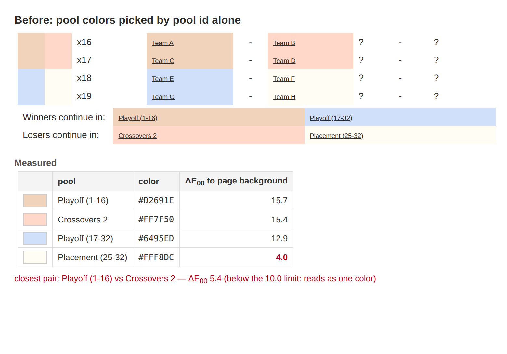
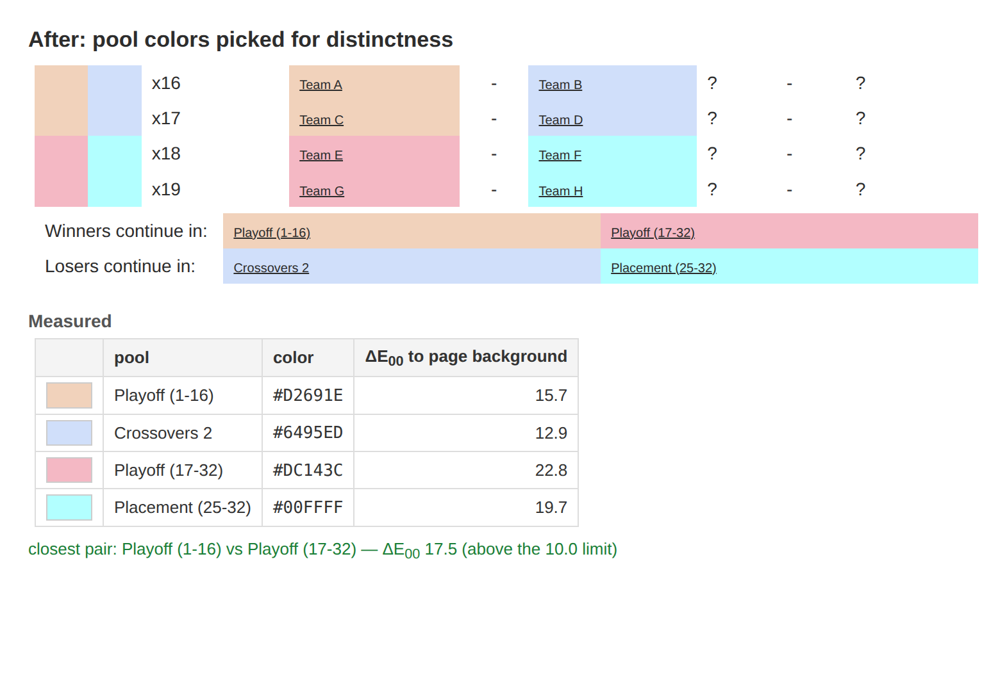

# Customization

Installation-specific look and feel lives under `cust/<id>/`. `cust/default` is
the base skin; the active skin is selected by the `CUSTOMIZATIONS` constant in
`conf/config.inc.php`. This document currently covers the **CSS color token
system** and how a skin recolors the UI; more customization topics (logos,
layouts, PDF hooks) can be added here over time.

## Skin CSS cascade

`styles()` in `localization.php` emits `cust/default/ultiorganizer.css` first,
then the active skin's `cust/<id>/ultiorganizer.css` on top when it exists and
is not `default`. `mobileStyles()` uses the same cascade with
`ultiorganizer-mobile.css`. A skin file therefore only needs the rules (and
tokens) that differ from default; anything it omits is inherited from default.

Because the skin stylesheet loads **after** default, anything it redefines wins
on equal specificity — including CSS custom properties on `:root`.

## Color tokens

`cust/default/ultiorganizer.css` defines the palette as CSS custom properties
(design tokens) in a `:root` block, and every color in the default skin is
written as `var(--token)`. Changing a token value re-colors every rule that uses
it. The tokens, grouped by role:

| Group | Token | Controls |
|---|---|---|
| Surfaces | `--canvas` | Page backdrop behind the content card |
| | `--surface` | Card / content / table background (white) |
| | `--surface-muted` | Subtle grey fill: top header bar, left-menu boxes, page-menu tabs |
| Text | `--text` | Primary body text |
| | `--text-muted` | Secondary / meta text |
| | `--text-faint` | Low-emphasis / disabled text |
| | `--text-inverse` | Text on dark backgrounds |
| Links | `--link` | Link text |
| | `--link-hover` | Link hover / focus |
| Accent | `--accent` | Primary accent: active nav, header title, calendar header |
| | `--accent-strong` | Stronger accent: selected grouping link, delete-button hover |
| | `--accent-deep` | Darkest accent: active page-menu tab text |
| Borders | `--menu-border` | Left-menu box border |
| | `--border-strong` | Dark borders / dividers |
| | `--border` | Light borders (table cell lines) |
| Tables | `--table-header-bg` | Table header background |
| | `--table-header-text` | Table header text |
| | `--table-row-odd` | Odd row background |
| | `--table-row-even` | Even (zebra) row background |
| | `--table-row-hover` | Row hover background |
| | `--admin-row-alt` | Admin-table alternate row tint |
| Menu & nav | `--menu-section-bg` | Menu section heading background |
| | `--menu-highlight` | Nav hover background |
| | `--menu-dropdown-bg` | Season dropdown background |
| | `--menu-dropdown-border` | Season dropdown border |
| Page-menu tabs | `--tab-border` | Tab border |
| | `--tab-hover-bg` | Tab hover background |
| | `--tab-hover-border` | Tab hover border |
| | `--tab-active-bg` | Active tab background |
| | `--tab-active-border` | Active tab border |
| Teams | `--team-home` | Home team color (row background + font color) |
| | `--team-away` | Away / guest team color |
| Status | `--status-warning` | Warning / error text |
| | `--status-positive` | Positive value text |
| | `--status-negative` | Negative value text |
| | `--status-warning-bg` | Attention / warning highlight background |
| | `--highlight` | Row / selection highlight background |
| | `--played-bg` | Played / disabled grey background |
| | `--halftime-bg` | Half-time row background |

Several tokens intentionally share a value in default (for example `--text`,
`--link`, and `--table-header-bg` are all the same near-black) but stay distinct
names so a skin can diverge them.

## Recoloring a skin with tokens

A skin recolors the whole UI by **redefining tokens in its own `:root`** — no
per-selector overrides needed, because default's rules already read the tokens:

```css
/* cust/<id>/ultiorganizer.css */
:root {
	--accent: #0bc5e0;
	--team-home: #0bc5e0;
	--team-away: #ff7f02;
	/* ...only the tokens this skin changes... */
}
```

### Two declaration styles

Both render identically; pick per skin:

- **Overrides only** — list just the tokens that differ from default. Shortest,
  and the skin keeps inheriting any future default value for tokens it does not
  list.
- **Full palette listed** — list every token (default values for the ones the
  skin keeps, overrides for the rest), so the complete palette is visible in one
  place. Trade-off: the skin re-declares the whole palette, so later changes to
  default's base values do **not** propagate to the non-overridden tokens.

The maintained `slkl` and `wfdf` skins list the full palette for easier human
editing and tag their changed values with `/* slkl */` or `/* wfdf */`.
Their non-color rules remain minimal so layout and behavior stay aligned with
`default`.

### Exceptions that are not tokens

Some skin colors do not map to a single default token (a shade used in only one
place, or a value that would collide with another token's role). Keep those as
ordinary per-selector rules below the `:root` block — for example a page-menu
hover color that must stay darker than the skin's accent. Structural overrides
(widths, fonts, logos, custom layout) also remain as normal rules; tokens are
for color only.

### Mobile app palette

`cust/default/ultiorganizer-mobile.css`, used by Scorekeeper, Spiritkeeper, and
Timekeeper, has a separate complete palette because `mobileStyles()` does not
load the desktop stylesheet. Shared concepts use the desktop token names, such
as `--canvas`, `--surface`, `--text-muted`, `--text-inverse`, `--link`,
`--accent`, `--border`, and the `--table-row-*` tokens.
Only the default mobile primary colors (`--link`, `--accent`, and
`--accent-strong`) mirror desktop values; its neutral and semantic colors remain
mobile-specific.

Mobile-only concepts extend that vocabulary with semantic tokens for gameplay,
secondary actions, notices, and Timekeeper states. Keep literal color values in
the `:root` palette and use `var(--token)` in component rules. An installation
can recolor the mobile apps independently by adding
`cust/<id>/ultiorganizer-mobile.css` and redefining the relevant tokens.
The maintained SLKL and WFDF skins include full mobile palettes in their
customization directories. Their changed values are tagged with `/* slkl */`
or `/* wfdf */`, matching the desktop palette convention.

## Pool colors

Pool color coding is not part of the token palette. Each pool carries its own
color in `uo_pool.color`, and the pool standings, schedule, and admin pages
paint cells with it to show which pool a team advances to. The candidate colors
come from `cust/default/pool_colors.php`, overridable per installation with
`cust/<id>/pool_colors.php` returning an array of 6-digit hex colors without
`#`; `PoolColors()` in `lib/pool.functions.php` reads and validates the list.

Pool colors are drawn at 30% opacity (`PoolColorAlpha()`), so the stored color
is not the color the reader sees: transparency pulls every entry towards the
page background and squeezes the palette together. Two pools whose stored
colors look unrelated can end up indistinguishable on the page, which makes
two advancement paths read as one. Pools created back to back also used to
land on neighboring palette entries, and a third of the neighboring pairs in
the default palette are indistinguishable once drawn.





`PoolPickColor()` therefore chooses a color instead of taking the palette entry
a pool id happens to land on. It compares candidates as they are rendered —
composited over the page background at the display opacity — using the
CIEDE2000 color difference from `lib/common.functions.php`
(`ColorToLab()`, `LabDifference()`, `ColorDifference()`, `ColorMinDifference()`,
`ColorsLookAlike()`, `PickDistinctColor()`). Rules:

- The palette is still scanned from the pool id onwards, so the spread of
  colors across an event is unchanged.
- A candidate is accepted when it stays `ColorDifferenceThreshold()` (10.0
  CIEDE2000) away from every color already used in the division, from the
  colors used elsewhere in the event, and from the plain page background.
- Distinctness inside the division wins when the palette cannot satisfy both.
- When no candidate satisfies the threshold, the most distinct one is used.

A custom palette is compared the same way, so a palette of near-identical
tints simply leaves fewer usable colors. Comparisons assume the light page
background; a skin with a dark surface changes which entries wash out, so a
dark skin needs its own palette review.

Existing events are not migrated automatically. The superadmin plugin at
`?view=plugins/update_pool_colors` lists an event's pools with the color coding
as readers see it, names the pools that cannot be told apart, preselects them,
and recolors the selected pools through `PoolRecolor()`. Colors set by hand in
`admin/addseasonpools.php` are left alone.

## Dark mode

Because the default skin is fully tokenized, a dark theme is a block that
redefines the token values. The lowest-effort form follows the operating
system, with no markup or server changes:

```css
@media (prefers-color-scheme: dark) {
	:root {
		--canvas: #1a1a1a;
		--surface: #242424;
		--text: #e6e6e6;
		--table-header-bg: #333333;
		/* ...dark values for the remaining tokens... */
	}
}
```

Notes:
- Design the dark relationships deliberately (light text on dark surfaces);
  it is not a value inversion.
- The default desktop and mobile stylesheets are both fully tokenized but load
  independently. A skin that still hardcodes colors, or redefines `:root`
  without a media query, will override these dark values — put a skin's dark
  overrides inside the skin (and inside the media query).
- Non-color assets (logos, icons) do not follow tokens and may need dark
  variants.

## Verification

The CSS lint/review skill is `docs/ai/css-style-and-lint/SKILL.md`. Run
Stylelint on changed files via the dev container:

```sh
docker compose -f docs/dev/compose.yaml exec -T dev stylelint "cust/**/*.css"
```

To preview a skin, set `CUSTOMIZATIONS` in `conf/config.inc.php` and reload. The
app caches rendered HTML (which embeds the skin's stylesheet link), so restart
the app container after switching skins mid-session:

```sh
docker compose -f docs/dev/compose.yaml restart app
```
